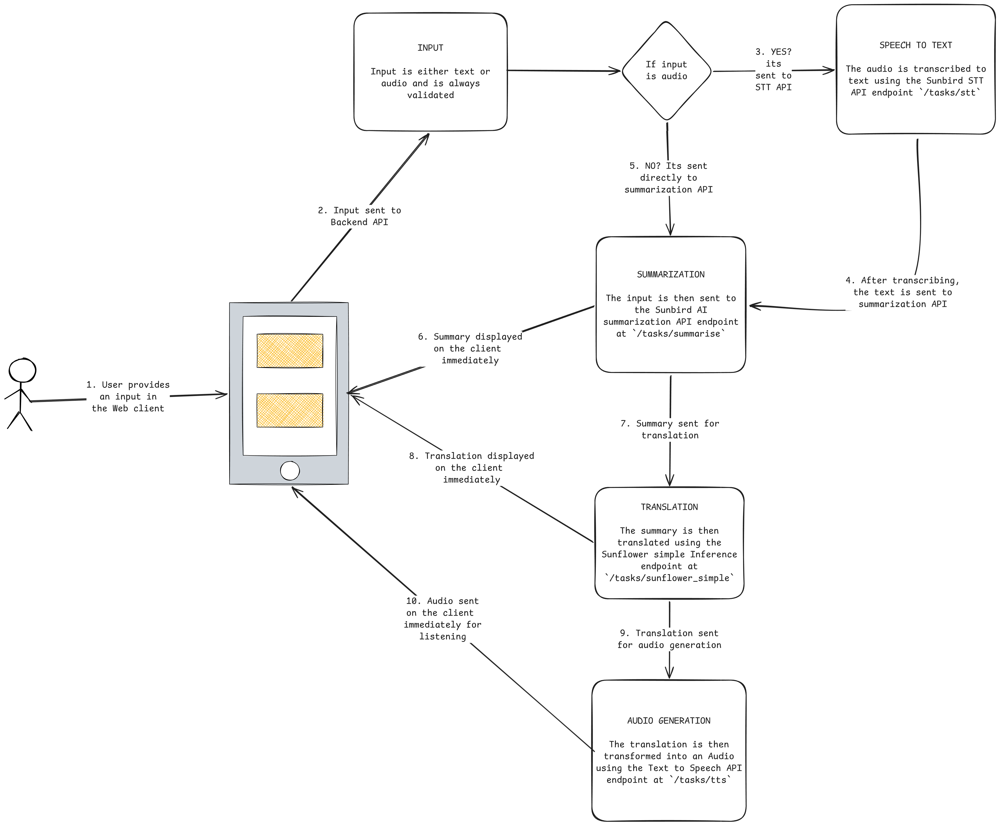
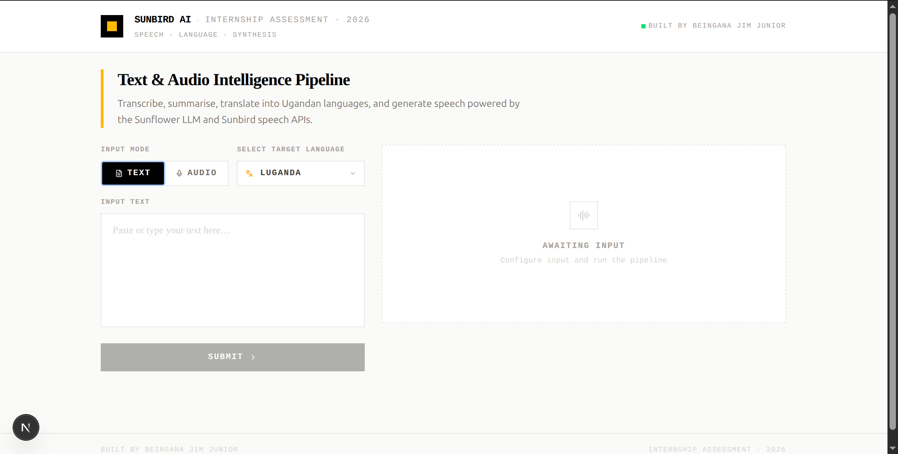
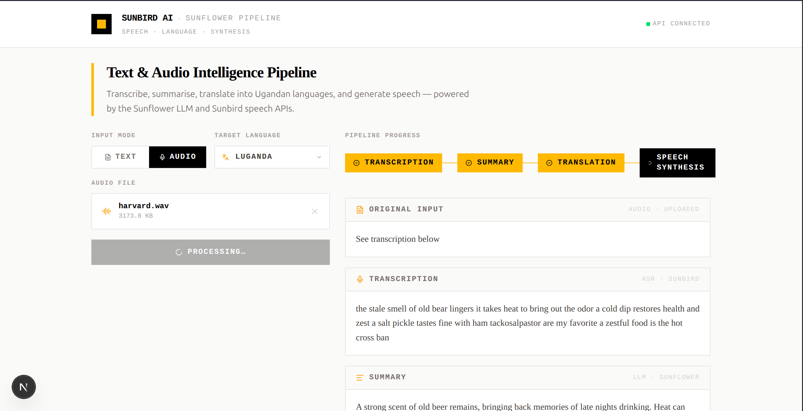
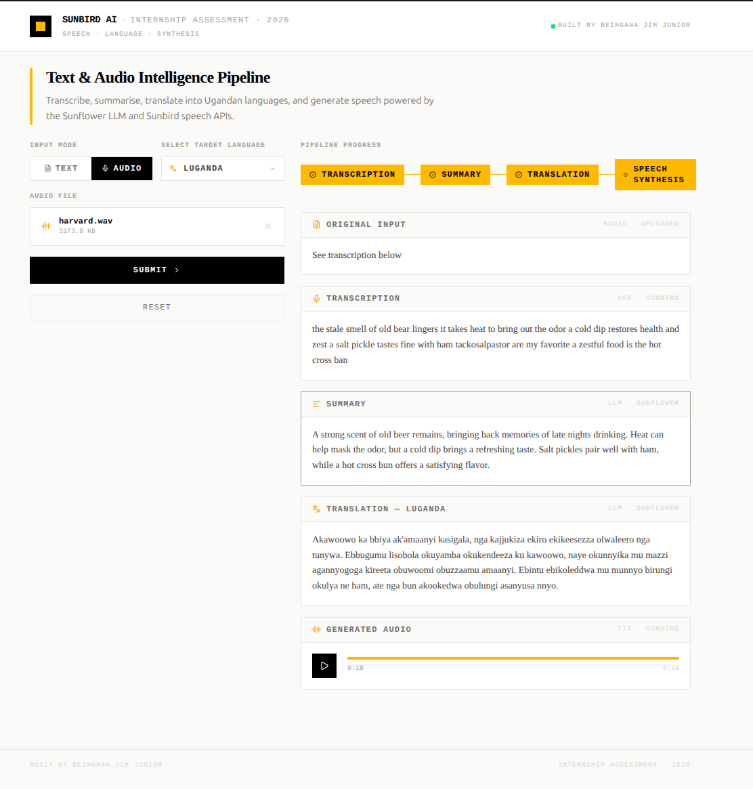

# Sunbird AI Internship Assessment Exercise

## Project Description

This project is a full-stack web application that serves as an AI-powered language processing pipeline tailored for Ugandan languages, the user provides either typed text or an uploaded audio file, which is then passed through four sequential stages: the audio is first transcribed to text using Sunbird's Speech-to-Text API, the text is summarised using the Sunflower LLM, the summary is translated into one of five Ugandan local languages (Luganda, Runyankole, Ateso, Lugbara, or Acholi), and finally the translated summary is converted back into spoken audio using Sunbird's Text-to-Speech API, with all results displayed in a clean, professional interface that shows the original text, summary, translation, and a playable audio clip.

## Architecture overview

The system follow the architecture as displayed below.



> Note: The numbering in the image shows the order of execution of events as they occur in the system.

## Local setup

To set up the project on your local environment, run these commands in sequence

1. Clone the Repository

```sh
git clone https://github.com/jim-junior/internship-assessment

cd internship-assessment
```

2. Setup Python Virtual Environment

```sh
python3 -m venv venv
```

3. Install project Dependencies

```sh
# Install python
pip install -r requirements.txt

# Then install Next.JS App deps
npm install
```

4. Setup Environment Variables

Copy the `.env` template from `.env.example` file and paste it in a new `.env` file. It should look something like this

```
NEXT_PUBLIC_API_HOST=http://localhost:8000/api # Base URL for the FAST API backend.
SUNBIRD_API_TOKEN=<your_sunbird_api_token_here>
```

> More about these environment vaiables in the [Environment Variables](#environment-variables) section

5. Start the Application

If you have `make` install on your system, you can simply run

```sh
make start
```

Other wise you will need to start each component independently

```sh
# Start the frontend
npm run dev

# Start the API
uvicorn api.index:app --reload --port 8000
```

### Environment Variables

Each of the Environment Variables stands for the following

- `NEXT_PUBLIC_API_HOST`: This is the URL location of the API Backend plus the  `/api` route. In development it is simply `http://localhost:8000/api` but in production you will have to set it up the URL where the backend is deployed. If you deploy this repo as is to Vercel, just set it to the vercel domain provided to you since its configured to automatically deploy both the backend and frontend on the same route.
- `SUNBIRD_API_TOKEN`: This variable reperesents you Sunbird API token. You can get one at the [Sunbird AI API Portal](https://api.sunbird.ai/).

## Usage

When you open the application UI, for the first time. You will be presented with something like this



On the left side on the UI, is the Input section where you can provide your input and select the language you would like to have a translated summary in.

The input can either be text or Audio. Use the Tabs above the imput box to choose what input mode you would prefer.

Then select the language you would like your summary to be translated in.

After that You can then click submit and the process will begin. You should see something like this.



Finally, your Summary, Translation and Audio will be generated and you can play and listen to the Audio. It should look something like this.



### Deployed link

You can access the live Application At: [https://internship-assessment-beryl.vercel.app](https://internship-assessment-beryl.vercel.app/)

## Known limitations

The Application wont process audio files that are over 5 minutes long.